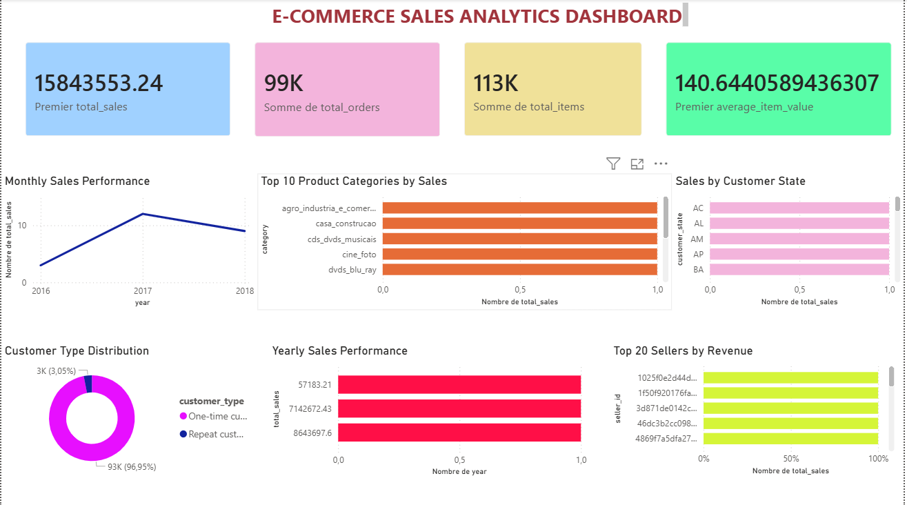

# E-Commerce Data Warehouse & Sales Analytics

An end-to-end data warehousing and analytics project built from Brazilian e-commerce transaction data. The project transforms raw transactional data into a structured PostgreSQL data warehouse, performs analytical SQL queries, and delivers an interactive Power BI dashboard for business insights.

---

##  Project Overview

This project demonstrates a complete data analytics workflow:

**Raw Data → ETL → PostgreSQL Data Warehouse → SQL Analytics → Power BI Dashboard**

The goal is to build a reliable analytical environment that enables businesses to understand sales performance, customer behavior, product performance, seller performance, and geographic trends.

---

##  Business Questions

The project addresses questions such as:

* How much revenue is being generated overall?
* How are sales changing over time?
* Which product categories generate the most revenue?
* Which Brazilian states generate the most sales?
* What proportion of customers are one-time versus repeat customers?
* Which products and sellers generate the highest revenue?
* How does sales performance vary across years?
* Which cities contribute the most to sales?
* How significant are freight costs relative to product sales?

---

##  Data Warehouse Architecture

The data warehouse follows a **star schema** designed for analytical querying.

### Fact Table

**`fact_sales`**

Contains transactional sales information:

* `sales_key`
* `order_id`
* `order_item_id`
* `customer_key`
* `product_key`
* `seller_key`
* `date_key`
* `price`
* `freight_value`
* `item_total`

### Dimension Tables

**`dim_customer`**

Contains customer information including:

* Customer ID
* Customer unique ID
* ZIP code
* City
* State

**`dim_product`**

Contains product information including:

* Product ID
* Product category
* Product dimensions
* Product weight
* Product description and name lengths
* Number of product photos

**`dim_seller`**

Contains seller information including:

* Seller ID
* ZIP code
* City
* State

**`dim_date`**

Provides time-based analytical attributes:

* Full date
* Year
* Quarter
* Month
* Month name
* Day
* Day of week
* Day name

---

##  Warehouse Scale

After the ETL process, the warehouse contains:

| Component     | Records |
| ------------- | ------: |
| Customers     |  99,441 |
| Products      |  32,951 |
| Sellers       |   3,095 |
| Dates         |     774 |
| Sales records | 112,650 |

The `fact_sales` table contains **112,650 transaction-line records**.

---

##  ETL Pipeline

The project uses Python to extract, transform, validate, and load the data into PostgreSQL.

### 1. Extract

Raw Brazilian e-commerce datasets are read from the project data sources.

### 2. Transform

The ETL process:

* Cleans and prepares source data
* Creates dimension records
* Generates surrogate keys
* Builds the date dimension
* Joins orders with order items
* Maps transactional records to dimension keys
* Calculates `item_total`
* Validates dimension mappings

### 3. Load

The transformed data is loaded into PostgreSQL:

```text
dim_customer
dim_product
dim_seller
dim_date
       ↓
   fact_sales
```

Foreign-key relationships maintain referential integrity between the fact and dimension tables.

---

##  Data Validation

Before loading the fact table, dimension mappings were explicitly validated.

The ETL pipeline confirmed:

* Missing customer keys: **0**
* Missing product keys: **0**
* Missing seller keys: **0**
* Missing date keys: **0**

The final fact table successfully loaded **112,650 records**.

---

##  SQL Analytics

Analytical SQL queries were developed to generate reusable datasets for reporting.

The analysis includes:

1. Overall sales KPIs
2. Monthly sales performance
3. Sales by product category
4. Sales by customer state
5. One-time vs. repeat customers
6. Yearly sales performance
7. Top 20 products by revenue
8. Top 20 sellers by revenue
9. Sales by category and year
10. Top cities by sales
11. Freight analysis
12. Product category sales ranking

The resulting analytical datasets are exported as CSV files for visualization.

---

##  Power BI Dashboard

The analytical datasets are connected to Power BI to create an interactive sales analytics dashboard.


### Dashboard includes

* Overall Sales KPIs
* Monthly Sales Performance
* Yearly Sales Performance
* Product Category Analysis
* Geographic Sales Analysis
* Customer Type Distribution
* Top Seller Analysis

The dashboard is designed to provide a high-level overview while allowing users to explore sales trends and business performance.

---

##  Key Insights

The analysis revealed several important patterns.

### Sales Growth

Sales increased substantially from 2016 to 2017 and continued growing through 2018.

### Geographic Concentration

São Paulo (`SP`) represents the largest sales market, followed by states such as Rio de Janeiro (`RJ`) and Minas Gerais (`MG`).

### Customer Behavior

The customer base is heavily dominated by one-time customers, highlighting a significant opportunity for customer retention and repeat purchases.

### Product Categories

A relatively small group of product categories accounts for a significant share of total revenue, making category-level performance particularly important for business decisions.

### Seller Performance

Revenue is concentrated among a number of high-performing sellers, allowing the business to identify key seller relationships and performance leaders.

---

##  Technologies

* **Python**
* **Pandas**
* **NumPy**
* **SQLAlchemy**
* **psycopg2**
* **python-dotenv**
* **PostgreSQL**
* **SQL**
* **Power BI**
* **Jupyter Notebook**

---

##  Project Structure

```text
ecommerce-data-warehouse/
│
├── data/
│   └── analytics/
│       ├── overall_kpis.csv
│       ├── monthly_sales.csv
│       ├── category_sales.csv
│       ├── state_sales.csv
│       ├── customer_type.csv
│       ├── yearly_sales.csv
│       ├── top_products.csv
│       ├── top_sellers.csv
│       ├── category_year.csv
│       ├── city_sales.csv
│       ├── freight_analysis.csv
│       └── category_ranking.csv
│
├── etl/
│   ├── load_dimensions.py
│   ├── load_date.py
│   ├── load_fact.py
│   └── export_analytics.py
│
├── sql/
│   ├── schema.sql
│   └── analytics.sql
│
├── powerbi/
│   └── ecommerce_sales_dashboard.pbix
│
├── requirements.txt
├── .gitignore
└── README.md
```

> File names may vary slightly depending on the final project structure.

---

##  Setup

### 1. Clone the repository

```bash
git clone <repository-url>
cd ecommerce-data-warehouse
```

### 2. Create a virtual environment

```bash
python -m venv .venv
```

Activate it on Windows:

```powershell
.venv\Scripts\activate
```

### 3. Install dependencies

```bash
pip install -r requirements.txt
```

### 4. Configure PostgreSQL

Create a local PostgreSQL database and configure the connection through environment variables.

Create a `.env` file:

```text
POSTGRES_HOST=localhost
POSTGRES_PORT=5432
POSTGRES_DB=ecommerce_dw
POSTGRES_USER=postgres
POSTGRES_PASSWORD=your_password
```

**Never commit the `.env` file to GitHub.**

### 5. Create the warehouse schema

Run the SQL schema script in PostgreSQL/pgAdmin.

### 6. Run the ETL pipeline

Run the dimension, date, and fact loading scripts in the appropriate order.

### 7. Export analytics

Run the analytics export script to generate the CSV datasets used by the dashboard.

### 8. Open the Power BI dashboard

Open:

```text
powerbi/ecommerce_sales_dashboard.pbix
```

---

##  Data & Security

Raw datasets and environment files containing credentials are excluded from the repository through `.gitignore`.

The repository contains analytical outputs and project code while keeping local credentials and raw data separate.

---

##  Project Status

**Completed**

* [x] Data preparation
* [x] PostgreSQL warehouse schema
* [x] Customer dimension
* [x] Product dimension
* [x] Seller dimension
* [x] Date dimension
* [x] Fact sales table
* [x] ETL pipeline
* [x] Data validation
* [x] SQL analytics
* [x] Analytics CSV exports
* [x] Power BI dashboard
* [x] Dashboard formatting

---

##  Author

**Manar Khadouma**

Business Intelligence & Data Analytics Student

Interested in **Data Analytics, Data Engineering, Data Systems, Database Design, ETL/ELT Pipelines, and Query Optimization**.
